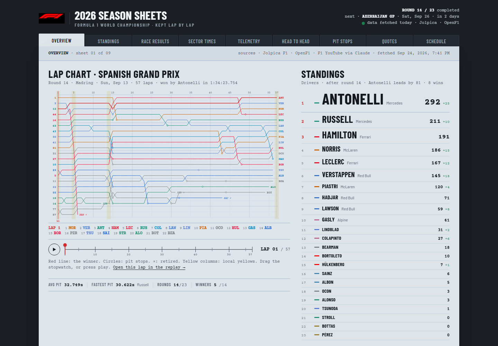
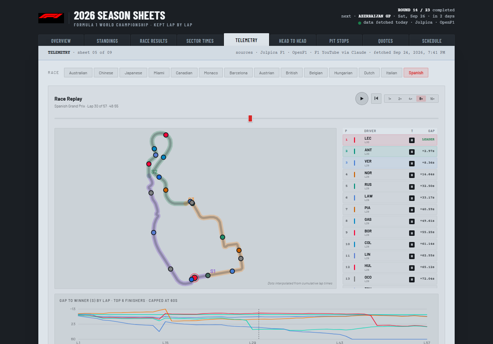
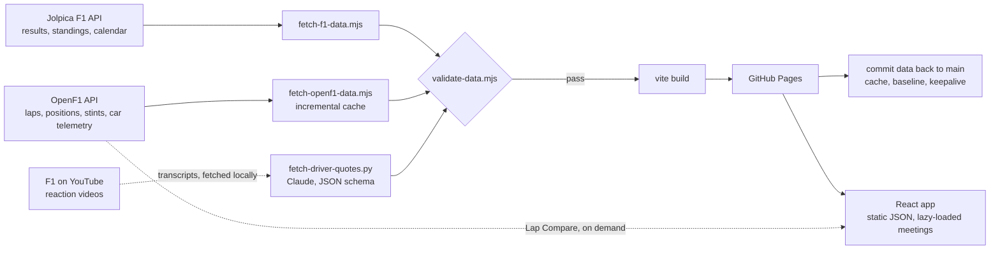

# F1 2026 Season Sheets

A Formula 1 season dashboard drawn as a timekeeper's lap chart, and the self-updating data pipeline behind it.

**Live: [rowanflynnpilot.github.io/f1-dashboard](https://rowanflynnpilot.github.io/f1-dashboard/)**



Three public sources are fetched, joined, validated and deployed on a schedule with no server and no manual step, apart from one: YouTube blocks cloud IPs, so reaction-video transcripts are fetched from a home machine. Every figure on the page traces back to a source and a fetch time printed on the sheet.

## What it shows

| Sheet | What's on it |
|---|---|
| **Overview** | The last Grand Prix as a lap chart (positions by lap, pit stops, yellow flags) with a stopwatch scrubber, the standings, the podium and the next race |
| **Standings** | Drivers' and constructors' championships, points progression by round, a generated season narrative |
| **Race Results** | Every race and sprint classification with starting grid, places gained, and OpenF1 sector data |
| **Sector Times** | Best sectors and speed traps per session, a circuit map coloured by the fastest team in each sector |
| **Telemetry** | Race replay on the circuit outline, gap to the winner, lap times, positions, tyre strategy and degradation, and Lap Compare: two drivers' speed, throttle and brake through the same lap |
| **Head to Head** | Team-mate battles in qualifying, race finishes and points, one per pairing |
| **Pit Stops** | Every stop of every race, ranked, relative to that race's median |
| **Quotes** | What drivers said after each session, extracted from F1's reaction videos |
| **Schedule** | The calendar in your time zone, with sprint weekends and results |

Every view has its own URL, so links go straight to it, for example [the Spanish GP replay at lap 30](https://rowanflynnpilot.github.io/f1-dashboard/#tab=telemetry&r=14&lap=30). Back and Forward move between sheets.



## How it works



A GitHub Actions workflow runs on every push and on three crons timed around race weekends (Saturday evening, Sunday night, Monday morning, UTC).

- **Three sources, one join.** Jolpica supplies the official classification, OpenF1 the lap-by-lap data. Their names disagree (OpenF1's "Bahrain Grand Prix" is Jolpica's "Bahrain Grand Prix in Malaysia"), so meetings are joined to rounds by race date and stamped with the round.
- **Incremental, and it persists itself.** A race weekend is final once its race has lap positions, so OpenF1 meetings are served from a cache that CI commits back to `main` after each deploy. The same commit keeps the validator's baseline current and keeps the repository active, so GitHub never disables the schedule for inactivity.
- **Validated before it ships.** `validate-data.mjs` fails the deploy on malformed data (a truncated classification, a season under way with no standings) or on data that shrank since the last deploy, so a bad fetch leaves the previous site live. A new season legitimately starts empty and is recognised as such, and a manual `allow_shrink` covers a round leaving the calendar.
- **Fails soft, and says so.** Each source can fail without blocking the others. The run then turns red, and a job summary lists what each source shipped and whether quotes lag the results.
- **Correct under real-world edge cases.** Teams follow each round's classification (2026: Lawson moved to Red Bull at round 12, so head-to-heads and team breakdowns split at that round). Retirements come from Jolpica's position text, not its numeric position. The points delta follows the round the standings cover, which matters on a sprint Saturday.
- **Precomputed where a browser would struggle.** Lap Compare's default view ships inside the meeting file, so the Telemetry tab opens without live API calls; OpenF1's free tier allows about three requests a second.
- **LLM extraction with guardrails.** Quotes are extracted from auto-captions with a JSON schema, a per-round roster so a mid-season seat change doesn't relabel older quotes, explicit handling of truncated or refused responses, and manual overrides for misattributions.

## Design

The visual system is written down in [DESIGN.md](DESIGN.md): ruled timing sheets on a dark bench, every figure in Courier Prime, each car in its team colour, no glows or gradients. [PRODUCT.md](PRODUCT.md) records who the dashboard is for and what it has to do.

## Run it locally

```bash
npm ci
npm run fetch-all   # Jolpica + OpenF1 into public/
npm run dev
```

Driver quotes need Python 3.10+, `pip install youtube-transcript-api anthropic requests` and an `ANTHROPIC_API_KEY`:

```bash
python scripts/fetch-driver-quotes.py --fetch-transcripts   # from a home connection
python scripts/fetch-driver-quotes.py                       # extract quotes
```

## Quality gates

- `npm run lint` runs ESLint with React's hooks rules as errors.
- `npm test` runs node:test over the fetch helpers, the validator and the dashboard's data transforms.
- CI runs both before any data is fetched, then the validator before the build.

## Project layout

```
.github/workflows/deploy.yml   fetch → validate → build → deploy → commit data back
scripts/                       fetch scripts, validator, commit and summary helpers
src/App.jsx                    the dashboard: every sheet and component
src/data.js                    pure data logic (transforms, statuses, joins)
src/styles.css                 design tokens and sheet styles
public/                        fetched data (data.json, openf1/, driver-quotes.json, tracks.json)
test/                          node:test suites
```

## Credits

Race data from [Jolpica F1](https://github.com/jolpica/jolpica-f1) and [OpenF1](https://openf1.org). Driver quotes are extracted from [Formula 1's YouTube channel](https://www.youtube.com/@Formula1). Circuit outlines come from [bacinger/f1-circuits](https://github.com/bacinger/f1-circuits).

The code is MIT-licensed. Formula 1 names, driver photos and team logos belong to their owners. This is an unofficial fan project and is not affiliated with Formula 1.
